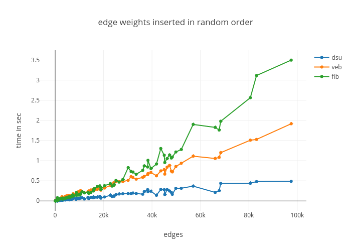
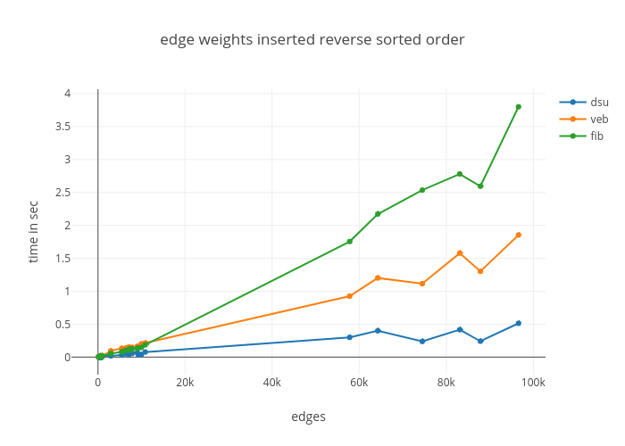

Objective
=========

Kruskal’s algorithm implementation using vEB tree, fibonacci heap and normal union find algorithm and their performance comparison

Introduction
============

Minimum spanning tree
---------------------

A minimum spanning tree (MST) is a subset of the edges of a connected, weighted (un)directed graph that connects all the vertices together, without any cycles and with the minimum possible total edge weight. That is, it is a spanning tree whose sum of edge weights is as small as possible. More generally, any edge-weighted un-directed graph (not necessarily connected) has a minimum spanning forest, which is a union of the minimum spanning trees for its connected components.

### Use cases

1.  Building a connected network: There are scenarios where we have a limited set of possible routes, and we want to select a subset that will make our network (e.g electrical grid, computer network) fully connected at the lowest cost

2.  Clustering: If you want to cluster a bunch of points into k clusters, then one approach is to compute a minimum spanning tree and then drop the k-1 most expensive edges of the MST. This separates the MST into a forest with k connected components; each component is a cluster.

Kruskal Algorithm
-----------------

Kruskal’s algorithm is a minimum-spanning-tree algorithm which finds an edge of the least possible weight that connects any two trees in the forest. It is a greedy algorithm in graph theory as it finds a minimum spanning tree for a connected weighted graph adding non decreasing cost edges at each step. This means it finds a subset of the edges that forms a tree that includes every vertex, where the total weight of all the edges in the tree is minimized. If the graph is not connected, then it finds a minimum spanning forest (a minimum spanning tree for each connected component).

Disjoint Data Structure
-----------------------

A disjoint-set data structure is a data structure that tracks a set of elements partitioned into a number of disjoint (non-overlapping) subsets. It provides near-constant-time operations to add new sets, to merge existing sets, and to determine whether elements are in the same set. Disjoint-sets play a key role in Kruskal’s algorithm for finding the minimum spanning tree of a graph.

### Operations

1.  MakeSet: Makes a new set by creating a new element with a unique id, and initializing the parent to itself. The MakeSet operation has O(1) time complexity, so initializing n sets has O(n) time complexity

2.  Find(x): Follows the chain of parent pointers from x till the root element, whose parent is itself. Returns the root element. Time Complexity: O(logn)

3.  Path compression: Path compression flattens the structure of the tree by making every node point to the root whenever Find is used on it. This is valid, since each element visited on the way to a root is part of the same set. The resulting flatter tree speeds up future operations not only on these elements, but also on those referencing them.

4.  Union(x,y): Merges x and y into the same partition by attaching the root of one to the root of the other. If this is done naively, such as by always making x a child of y, the height of the trees can grow as O(n). To prevent this union by rank or union by size is used by rank

#### Union by rank:

Union by rank always attaches the shorter tree to the root of the taller tree. Thus, the resulting tree is no taller than the originals unless they were of equal height, in which case the resulting tree is taller by one node. In union by rank, each element is associated with a rank. Initially a set has one element and a rank of zero. If two sets are unioned and have the same rank, the resulting set’s rank is one larger; otherwise, if two sets are unioned and have different ranks, the resulting set’s rank is the larger of the two. Ranks are used instead of height or depth because path compression will change the trees’ heights over time. by size

Fibonacci Heap
--------------

A Fibonacci heap is a collection of rooted trees that are min-heap ordered. That is, each tree obeys the min-heap property : the key of a node is greater than or equal to the key of its parent. Figure 2 below shows an example of a Fibonacci heap. Each node x contains a pointer x.p to its parent and a pointer x.child to any one of its children. The children of x are linked together in a circular, doubly linked list, which we call the child list of x . Each child y in a child list has pointers y.left and y.right that point to y’s left and right siblings, respectively. If node y is an only child, then y.left = y.right = y . Siblings may appear in a child list in any order.

1.  Operation insert works by creating a new heap with one element and doing merge. Time Complexity: O(1)

2.  Operation extract minimum operates in three phases. First we delete the root containing minimum element. It’s children will become roots of new trees. If the number of children was d, it takes time O(d) to process all new roots. Time Complexity: O(d) = O(log n).

vEB Tree
--------

A Van Emde Boas tree, also known as a vEB tree, is a tree data structure which stores integers between [0, n-1] for a positive integer n. It performs all operations in O(log m) time, or equivalently in O(log log M) time, where M=2m is the maximum number of elements that can be stored in the tree. The M is not to be confused with the actual number of elements stored in the tree, by which the performance of other tree data-structures is often measured.

### The following operations of vEB Tree are used for the project:

1.  Insert: insert a m-bit value into the tree. Time Complexity: O(loglogM)

2.  Delete: insert a m-bit value into the tree. Time Complexity: O(loglogM)

3.  Min/Max: find the minimum/maximum value present in the tree. Time Complexity: O(1)

Kruskal Implementation
======================

Using merge sort
----------------

Steps:

1.  Initialize an empty set A

2.  Create V trees, one containing each vertex

3.  Sort the edges of the graph G(V,E) in non-descending order by weight

4.  For each edge taken in non-descending order by weight, check whether the end points of the edge u, v belong to the same tree. If yes, the edge is discarded, else merge the 2 vertices into a single set and add the edge to A

Time Complexity: O(E LogE)

Using Fibonacci Heap
--------------------

In this, we use store the edges of the graph in a Fibonacci Heap. We call extract-min each time to get the edge with the smallest weight instead of sorting compared to the standard implementation. Rest of the algorithm remains the same.

Time Complexity: O(E log E)

Using vEB Tree
--------------

Used a hash table to store the multiple values of the same key. Once the count of the key goes down to zero, we delete the current min from the tree and update the min.

Implementation Challenges
=========================

1.  In vEB tree, the standard implementation doesn’t work when there are duplicate values present in the tree. For this, we had to use a hash table externally to store the edge count of each weight.

2.  While comparing vEB, Fibonnaci Heap and merge sort. From complexity it seems, that vEB tree(O(loglogu)) should perform better than Merge sort(O(nlogn)), but in actual, it is the opposite. After deep diving, we realised that the constants for vEB tree are much much higher than others, hence overall vEB tree doesn’t perform so well for Kruskal implementation

Results
=======

1.  Standard Kruskal with merge sort(dsu) outperforms the rest as its constants are much smaller

2.  vEB Tree(veb) performs worst at the beginning(less number of edges), but as the edge count increases vEB outperforms Fibonnaci(fib). This is because loglogu has a drastic effect only when u is very high, else logu and loglogu are almost same. Also, the constants for vEB tree are higher than that of Fibonnaci Heap.

3.  Tests were done when edges were inserted in random order, increasing order, and decreasing order. In all the 3 cases, the relative performance is consistent.

4.  For plotting the data, about 160 data points were used

Time Analysis
=============
  ### Time Complexity Comparison

  | **Merge Sort** |   **Fibonnaci Heap**   | **Van Emde Boas Tree**|
  |--------------| -------------------- |----------------------|
  |O(c1 * ElogE)  |    O(c2 * ElogE)       |    O(c3 * Eloglogu)   |

#### Figure demonstrating comparison of number of edges vs time required to compute mst-cost when edges are inserted in random edge weight order

#### Figure demonstrating comparison of number of edges vs time required to compute mst-cost when when edges are inserted in sorted edge weight order

#### Figure demonstrating comparison of number of edges vs time required to compute mst-cost when when edges are inserted in reversed sorted edge weight order

End user documentation
======================

Run kruskal algorithm using normal DSU
--------------------------------------

1.  Enter the directory

2.  Run ./generate to generate 150 files containing random number of edges with corressponding random edges weights of range 0-1000, 0-10000, 0-100000

3.  Run ./krudsu.sh to run the python code on each file and the output for each file will be generated in dsu.txt with number of edges on which it was run, number of seconds required to compute the mst-cost, and the mst-cost

Run kruskal algorithm using vEB tree
------------------------------------

1.  Enter the directory

2.  Run ./generate to generate 150 files containing random number of edges with corressponding random edges weights of range 0-1000, 0-10000, 0-100000

3.  Run ./kruveb.sh to run the python code on each file and the output for each file will be generated in veb.txt with number of edges on which it was run, number of seconds required to compute the mst-cost, and the mst-cost

Run kruskal algorithm using fibonacci heap
------------------------------------------

1.  Enter the directory

2.  Run ./generate to generate 150 files containing random number of edges with corressponding random edges weights of range 0-1000, 0-10000, 0-100000

3.  Run ./krufib.sh to run the python code on each file and the output for each file will be generated in fib.txt with number of edges on which it was run, number of seconds required to compute the mst-cost, and the mst-cost

Comparison of time complexity for each implementation
-----------------------------------------------------

1.  Enter the directory

2.  Run ./generate to generate 150 files containing random number of edges with corressponding random edges weights of range 0-1000, 0-10000, 0-100000

3.  Run ./setup.sh to generate plot that shows the comparison of time required to output mst-cost for each of the implementation

Running the code on custom user input
-------------------------------------

### Running vEB tree implementation

1.  Run the python code using python3 kruskl_veb.py

2.  Enter number of edges

3.  Enter the number of vertices

4.  For each edge

    1.  Enter linked vertex 1

    2.  Enter linked vertex 2

    3.  Enter the edge weight

5.  Enter to get the number of input edges on which it was run, time required to get mst-cost and their corresponding mst-cost

### Running normal DSU tree implementation

1.  Run the python code using python3 krudsu.py

2.  Enter number of edges

3.  Enter the number of vertices

4.  For each edge

    1.  Enter linked vertex 1

    2.  Enter linked vertex 2

    3.  Enter the edge weight

5.  Enter to get the number of input edges on which it was run, time required to get mst-cost and their corresponding mst-cost

### Running fibonacci tree implementation

1.  Run the python code using python3 krskal_fibbonacci.py

2.  Enter number of edges

3.  Enter the number of vertices

4.  For each edge

    1.  Enter linked vertex 1

    2.  Enter linked vertex 2

    3.  Enter the edge weight

5.  Enter to get the number of input edges on which it was run, time required to get mst-cost and their corresponding mst-cost

References
==========

1.  [Algorithm’s II university of cambridge](https://www.cl.cam.ac.uk/teaching/1314/AlgorithII/2013-stajano-algs2-students-handout.pdf)

2.  [Lecture 4: Divide and Conquer:van Emde Boas Trees](https://ocw.mit.edu/courses/electrical-engineering-and-computer-science/6-046j-design-and-analysis-of-algorithms-spring-2015/lecture-notes/MIT6_046JS15_lec04.pdf)

3.  [Introduction to Algorithms by CLRS](https://mcdtu.files.wordpress.com/2017/03/introduction-to-algorithms-3rd-edition-sep-2010.pdf)

4.  [Fibonacci Heaps by MIT](https://ocw.mit.edu/courses/electrical-engineering-and-computer-science/6-854j-advanced-algorithms-fall-2008/lecture-notes/lec1.pdf)

5.  [Fibonacci Heaps by Stanford](http://web.stanford.edu/class/archive/cs/cs166/cs166.1146/lectures/07/Small07.pdf)

6.  [Fibonacci Heaps by IIT Delhi](http://www.cse.iitd.ernet.in/~naveen/courses/CSL630/x02-fiboheap.pdf)

7.  [Kruskal’s Algorithm using disjint set union find algorithm](https://ocw.mit.edu/courses/electrical-engineering-and-computer-science/6-046j-design-and-analysis-of-algorithms-spring-2012/lecture-notes/MIT6_046JS12_lec04.pdf)

8.  [Disjint set data structure](https://en.wikipedia.org/wiki/Disjoint-set_data_structure)

9.  [Fibbonaci Heap](https://en.wikipedia.org/wiki/Fibonacci_heap)

10. [Van Emde Boas Tree](https://en.wikipedia.org/wiki/Van_Emde_Boas_tree)
